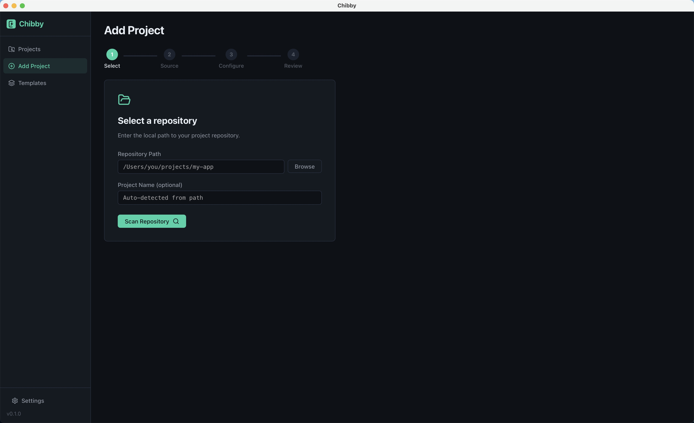
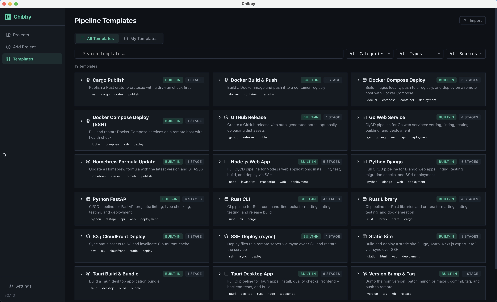
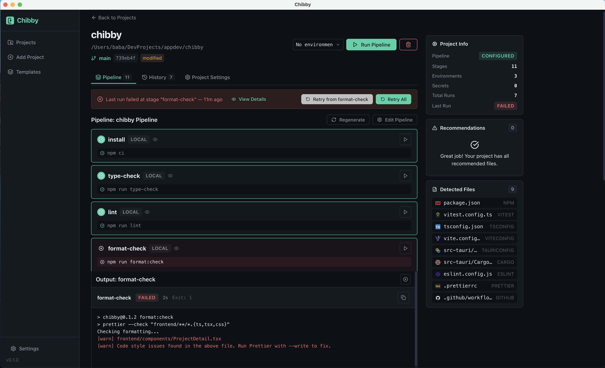

# Chibby

Local-first, open-source CI/CD and deployment tool for solo developers and small teams.

## Overview

Chibby helps developers turn existing scripts into visual, repeatable pipelines that run locally or over SSH. Instead of learning complex CI platforms, you import your existing `deploy.sh`, `Makefile`, `justfile`, or package scripts and get clear logs, run history, retry, and rollback capabilities.

## Screenshots

| Add Project | Pipeline Templates | Pipeline Run |
| --- | --- | --- |
|  |  |  |

## Features

- **Pipeline Templates** — 20 built-in templates (9 full pipelines + 11 stage snippets) with variable substitution, import/export, and 3-layer resolution ([Templates docs](docs/features/templates.md))
- **GitHub Actions Import** — Import stages from existing `.github/workflows/` into your pipeline
- **CLI** — Standalone command-line interface for headless servers and scripting ([CLI docs](docs/features/cli-commands.md))
- **Script Import** — Detect and import existing scripts from your repo
- **Pipeline Generation** — Auto-generate pipelines from detected commands (heuristic + LLM-assisted)
- **Local Execution** — Run stages as local processes with live log streaming
- **SSH Execution** — Deploy over SSH with direct commands or Docker Compose
- **Environments & Secrets** — Per-environment config, OS keychain values, per-developer `environments.local.toml` overrides, and a layered read-only view ([Env/Secrets docs](docs/features/env-secrets.md))
- **Bootstrap wizard** — Scans `.env*`, `docker-compose*.yml`, `.github/workflows/`, and JS/Python/Rust source for env/secret references and writes populated `environments.toml` + `secrets.toml` in Safe or Merge mode
- **Importers** — Pull names (and optionally values) from `.env` files, Vercel, Railway, and Fly.io; vendor CLI presence is auto-checked
- **Export .env** — Resolve variables + secret values for an environment to a flat `.env` file
- **Leak scanner** — Per-save scan of `environments.toml` for hardcoded GitHub/GitLab/Stripe/Slack/OpenAI/AWS/Twilio/DB-URL/private-key shapes, with redacted previews
- **Secret audit** — Per-secret history (last set/deleted, counts, provenance — `cli`, `gui`, `import:vercel`, etc.) visible from the GUI's clock icon
- **Env diff & Doctor** — `chibby env diff <a> <b>` shows `+ / - / ~` deltas between two environments; `chibby doctor` validates configs, SSH reachability, and keychain values end-to-end (CI-friendly exit codes)
- **Versioning** — Semver bumping across config files with automatic git tagging, configurable bump level (patch/minor/major)
- **Code Signing** — macOS notarization, Windows Authenticode, Linux GPG
- **Artifacts** — Consistent naming, SHA256 checksums, configurable retention, reveal-in-Finder
- **Tauri Updater** — Generate `latest.json`, sign update bundles, manage signing keys, dry-run/live publish to GitHub Releases / S3 / SCP / local
- **Security Gates** — Seven built-in gates: secret scanning (gitleaks), CVE scanning, commit linting, SAST (semgrep), container image scan (trivy image), IaC scan (trivy config), license compliance (cargo-license + license-checker). Per-gate quick actions, baseline creation, and configurable severity thresholds from the Quality tab. Auto-appended as pipeline stages when `.chibby/gates.toml` exists. ([Security gates docs](docs/features/security-gates.md))
- **Run History** — Full history with retry from failure, explicit rollback, and reveal-run-folder
- **Notifications** — Desktop OS notifications and webhooks (Slack, Discord, HTTP) with one-click test send
- **Crash log viewer** — Inspect, reveal, and clear `<data_dir>/crash.log` from the app
- **App Settings** — Configurable notification, retention, and bootstrap-mode defaults that apply across all projects
- **Cross-Platform** — Works on macOS, Linux, and Windows

## Why Chibby?

| | Chibby | GitHub Actions | GitLab CI | Jenkins | CircleCI |
| --- | --- | --- | --- | --- | --- |
| **Runs locally** | Yes — native, no containers needed | No (cloud) | No (cloud or self-hosted runner) | Self-hosted only | No (cloud) |
| **Zero config start** | Auto-detects scripts & generates pipelines | Manual YAML | Manual YAML | Manual Jenkinsfile | Manual YAML |
| **Internet required** | No — fully offline | Yes | Yes (or self-hosted) | No (self-hosted) | Yes |
| **Pricing** | Free & open-source | Free tier, paid minutes | Free tier, paid minutes | Free (self-hosted) | Free tier, paid credits |
| **Setup complexity** | Download and run | Repo + config + cloud | Repo + config + runners | Server + plugins + agents | Repo + config + cloud |
| **Secret management** | OS keychain (native) | Cloud secrets | Cloud variables | Credentials plugin | Cloud contexts |
| **Live logs** | Real-time in GUI & CLI | Delayed (cloud round-trip) | Delayed | Plugin-dependent | Delayed |
| **Run history & rollback** | Built-in with retry from failure | Re-run workflows | Retry jobs | Rebuild | Re-run |
| **SSH deploy** | First-class (direct + Docker Compose) | Via custom actions | Via scripts | Via plugins | Via orbs |
| **Best for** | Solo devs & tiny teams | Teams on GitHub | Teams on GitLab | Enterprise self-hosted | Teams wanting managed CI |

> **TL;DR** — Chibby is built for developers who want repeatable pipelines without cloud lock-in, YAML sprawl, or CI minutes. Import your existing scripts, run locally, deploy over SSH — done.

## Install

Download the latest release for your platform from
[GitHub Releases](https://github.com/Nyantahi/chibby/releases).

| Platform | Download |
| --- | --- |
| macOS (Apple Silicon) | `.dmg` |
| macOS (Intel) | `.dmg` |
| Linux (Debian/Ubuntu) | `.deb` |
| Linux (Fedora/RHEL) | `.rpm` |
| Linux (any distro) | `.AppImage` |
| Windows | `.exe` (NSIS installer) |

See the [installation guide](docs/guides/installation.md) for detailed
instructions, SSH setup, and secrets configuration per platform.

### Build from source

```bash
git clone https://github.com/Nyantahi/chibby.git
cd chibby
npm install
npm run tauri:build
```

Requires Node.js 20+, Rust (stable), and
[Tauri prerequisites](https://v2.tauri.app/start/prerequisites/) for your OS.

## Quick Start

1. **Add a Project** — Click "Add Project" and select a local repository
2. **Choose a Source** — Auto-detect from build files, import from GitHub Actions, or start from a template
3. **Configure Stages** — Toggle, reorder, and edit the generated stages
4. **Run** — Click "Run Pipeline" to execute all stages
5. **Monitor** — Watch live logs and stage status in real time

## Pipeline Configuration

Pipelines are stored as `.chibby/pipeline.toml` in each project:

```toml
name = "My Pipeline"

[[stages]]
name = "install"
commands = ["npm install"]
backend = "local"
fail_fast = true

[[stages]]
name = "test"
commands = ["npm test"]
backend = "local"
fail_fast = true

[[stages]]
name = "deploy"
commands = ["./deploy.sh"]
backend = "ssh"
fail_fast = true
```

See [examples/](examples/) for pipelines covering Node.js, Rust, Django, Docker
Compose, Tauri desktop apps, and static sites.

## Tech Stack

- **Frontend**: React + TypeScript + Vite
- **Backend**: Rust + Tauri v2
- **Storage**: Local file system (pipelines in `.chibby/` per repo, run history in app data)
- **Secrets**: OS keychain (macOS Keychain, GNOME Keyring / KDE Wallet, Windows Credential Manager)

## Project Structure

```text
chibby/
  frontend/           # React frontend
    components/       # UI components
    services/         # API calls to backend
    types/            # TypeScript interfaces
    styles/           # CSS styles
  src-tauri/          # Rust backend
    src/
      commands/       # Tauri command handlers
      engine/         # CI/CD engine
    build_checks/     # Platform-specific build validation
  examples/           # Example pipeline configurations
  docs/               # Documentation and guides
```

## Data Storage

- **Pipeline config**: `.chibby/pipeline.toml` (in repo, version controlled)
- **Environment config**: `.chibby/environments.toml` (in repo)
- **Per-developer overrides**: `.chibby/environments.local.toml` (auto-gitignored)
- **Secret references**: `.chibby/secrets.toml` (names only, no values)
- **Project templates**: `.chibby/templates/` (in repo, shareable with team)
- **User templates**: `~/.chibby/templates/` (global, personal collection)
- **Run history, settings & secret audit**: Platform app data directory
  - macOS: `~/Library/Application Support/Chibby/`
  - Linux: `~/.local/share/chibby/`
  - Windows: `%APPDATA%\Chibby\`
  - Audit metadata lives under `<data_dir>/secret_audit/<sha256[:16]>.json` (per-project, owner-only on Unix)

## Development

```bash
npm run tauri:dev      # Run development server
npm run type-check     # TypeScript type check
npm run lint           # ESLint
npm run format         # Prettier
npm test               # Vitest
npm run tauri:build    # Production build
```

## Contributing

See [CONTRIBUTING.md](docs/community/CONTRIBUTING.md) for development setup, workflow, and code style guidelines.

## License

MIT
